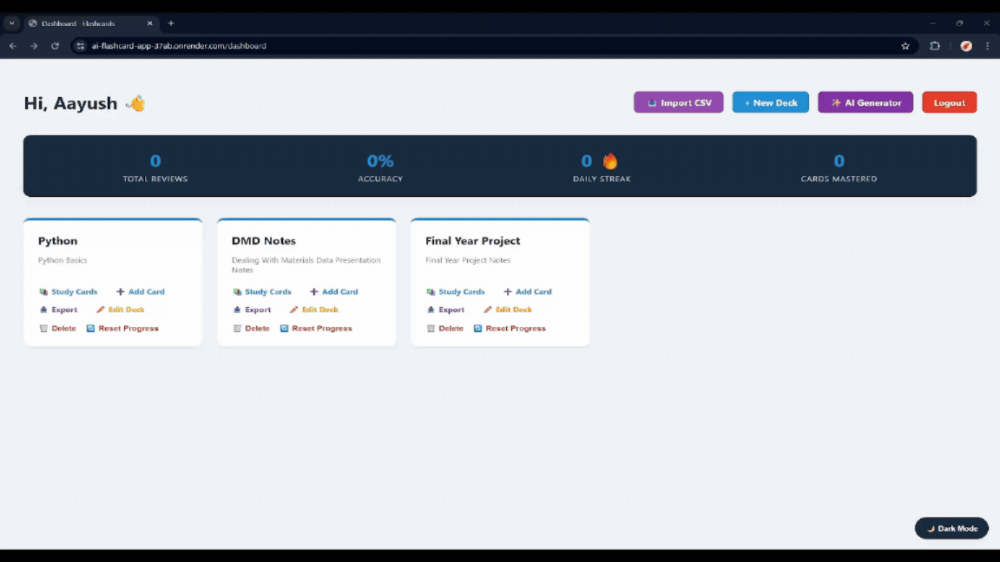

# 🧠 AI-Powered Spaced Repetition Flashcards


This web application is designed to improve study efficiency by combining algorithmic spaced repetition with AI-driven content generation.

This project explores the intersection of AI-assisted knowledge extraction and algorithmic learning optimization, combining LLM-based content generation with mathematically grounded review scheduling.

---

## 🎥 Demo

 *(Note: Demo will be added later)*

---

## 🤖 Working with the AI and Math

One of the key challenges was ensuring reliable structured output from the AI. I designed prompts to enforce strict JSON formatting and implemented validation logic to handle malformed or incomplete responses before saving them to the database. 

On the backend, I used the google-generativeai library to process large inputs such as lecture notes and convert them into structured flashcard data. At the same time, the application uses the SuperMemo-2 (SM-2) algorithm to calculate intervals and ease factors, enabling accurate scheduling of future reviews.

---

## 🚀 Key Features
**Smart Spaced Repetition:** The app uses the SM-2 algorithm to schedule your reviews based on how well you know the card (you can click Again, Hard, Good, or Easy).

**AI Flashcard Maker:** You can upload a PDF document or paste your notes, and the Gemini AI will pull out the most important concepts and make a flashcard deck for you.

**AI Card Fixer:** If you have a card that is too confusing, you can click a button and the AI will rewrite it to be shorter and easier to learn.

**Deck Summaries:** The AI can read all the cards in a deck and write a nice HTML summary of what the whole deck is about.

**Distraction-Free Study Mode:** I built a study screen with no distractions, featuring 3D card flip animations using CSS, and keyboard shortcuts!

**REST API:** I also made JSON endpoints (GET and POST) just in case I want to connect this to a mobile app later.

**Dark Mode & Stats:** The app is fully responsive, saves your Dark Mode preference using localStorage, and tracks your daily study streaks and correct answers.

---

## ⚙️ Advanced Engineering Highlights

* **Structured LLM Output Enforcement:** Designed prompt templates with strict schema constraints and implemented backend validation to handle malformed or partial AI responses before database injection.
* **Algorithmic Scheduling System:** Integrated the SM-2 spaced repetition algorithm to dynamically adjust review intervals and ease factors based on user performance.
* **Efficient Data Modeling:** Designed a relational SQLite database schema (User → Deck → Card) via SQLAlchemy, utilizing optimized time-based queries to only retrieve cards currently due for review.
* **Scalable API Design:** Built a full suite of RESTful JSON endpoints alongside the frontend to support potential future mobile or external integrations.

The system is designed for single-user or small-scale deployment, prioritizing correctness, clarity of implementation, and reliability of AI outputs over large-scale production optimization.

---

## 🛠 Tech Stack

**Frontend**
- HTML5 / CSS3 (CSS Variables for dynamic Light/Dark theming)
- Vanilla JavaScript (ES6 for AJAX requests and DOM manipulation)
- 3D CSS Transforms (Card flip animations)

**Backend**
- Python 3.10+
- Flask (Lightweight routing and controller logic)
- SQLAlchemy / SQLite3 (Local database with cascading deletes)
- `flask-login` (Secure user authentication and password hashing)

**APIs / DevOps**
- Google Gemini 2.5 Flash API
- `PyPDF2` (Document processing)
- Docker (Containerized deployment)

---

## 📸 Screenshots
*(Screenshots will be added later)*
### 1. Dashboard & Statistics
*(Featuring the dynamic statistics board and persistent dark mode UI)*


### 2. Interactive Study Session
*(Distraction-free mode with 3D flip animations and algorithmic rating controls)*


### 3. AI Generation & Summaries
*(PDF processing UI and the Gemini-generated HTML deck summaries)*


---

## ⚙️ How It Works

1. **Reading Files:** When you upload a .pdf, the backend uses PyPDF2 to read the text page by page.
2. **Talking to AI:** The system sends the extracted text in a specific prompt to the Gemini API, enforcing a strict JSON response schema of questions and answers.
3. **Saving Data:** The backend validates the JSON structure and persists new Card entities into the SQLite database via SQLAlchemy, linking them to your specific Deck.
4. **Studying:** When you click study, the backend only searches for cards where the next_review date is today or in the past.
5. **The Math:** When you rate a card (Again, Hard, Good, or Easy), the frontend sends the rating to the backend. The SM-2 formula updates the card's ease_factor and interval, and saves a new future date for you to see it again.

---

## 🧠 System Architecture

This application adheres to a modular **Model-View-Controller (MVC)** architecture:

* **Models (`app.py`):** I used SQLAlchemy classes to set up the database, like the `User` table, the `Deck` table, and the `Card` table (which holds the spaced-repetition math data).
* **Controller (`app.py`):** My Flask routes act as the controller. They make sure you are logged in (`@login_required`), handle the file uploads, talk to the AI, and save things to the database.
* **View (`templates/`):** I used Jinja2 to make reusable HTML templates (like `base.html`). I also used CSS for the dark mode and JavaScript to make the study sessions interactive.

---

## 💻 Local Installation
1. Clone the repository and create a virtual environment:
    ```bash
    git clone https://github.com/AayushWaney/ai-flashcards.git
    cd ai-flashcards
    python -m venv venv
    source venv/bin/activate  # On Windows use `venv\Scripts\activate`
    ```
2. Install the required dependencies:
    ```bash
    pip install -r requirements.txt
    ```
3. Set up your Environment Variables:
Create a `.env` file in the root directory and add your API and Secret keys:
    ```bash
    SECRET_KEY=your_secure_flask_key_here
    GEMINI_API_KEY=your_google_gemini_api_key_here
    ```
4. Boot the Flask Server:
    ```bash
    python app.py
    ```
5. Access the dashboard at:
    ```bash
    http://127.0.0.1:5000
    ```

**(Optional) Docker Deployment:** Run `docker compose up` to instantly build and launch the containerized version of the application.

---

## 🔮 Future Improvements
* Let users share their decks with a public link.
* Add a way to import Anki (.apkg) files directly.
* Organize my Flask code better by using Blueprints when the app gets bigger.

---

## 📁 Project Structure
```text
ai-flashcards/
│
├── .venv/                      # Python virtual environment (ignored in Git/Docker)
├── instance/
│   └── flashcards.db           # SQLite Database (Auto-generated)
│
├── templates/                  # Jinja2 HTML templates
│   ├── add_card.html
│   ├── base.html               # Master layout file
│   ├── create_deck.html
│   ├── dashboard.html
│   ├── deck_summary.html
│   ├── edit_card.html
│   ├── edit_deck.html
│   ├── generate_ai.html
│   ├── import_deck.html
│   ├── index.html              # Landing page
│   ├── login.html
│   ├── register.html
│   ├── study_session.html      # Interactive study UI
│   └── view_deck.html
│
├── .dockerignore               # Keeps the Docker image clean
├── .env                        # Local environment variables (API keys)
├── .gitignore                  # Keeps secrets out of GitHub
├── app.py                      # Main Flask application, routes, and DB models
├── docker-compose.yml          # Container orchestration configuration
├── Dockerfile                  # Instructions to build the Docker image
├── Readme.md                   # Project documentation
└── requirements.txt            # List of Python dependencies
```
---
## 👨‍💻 Author
Aayush Waney  
B.Tech – Metallurgical Engineering  
VNIT Nagpur

GitHub: https://github.com/AayushWaney

---

 ## 📄 License
This project is released for educational and portfolio purposes.

---